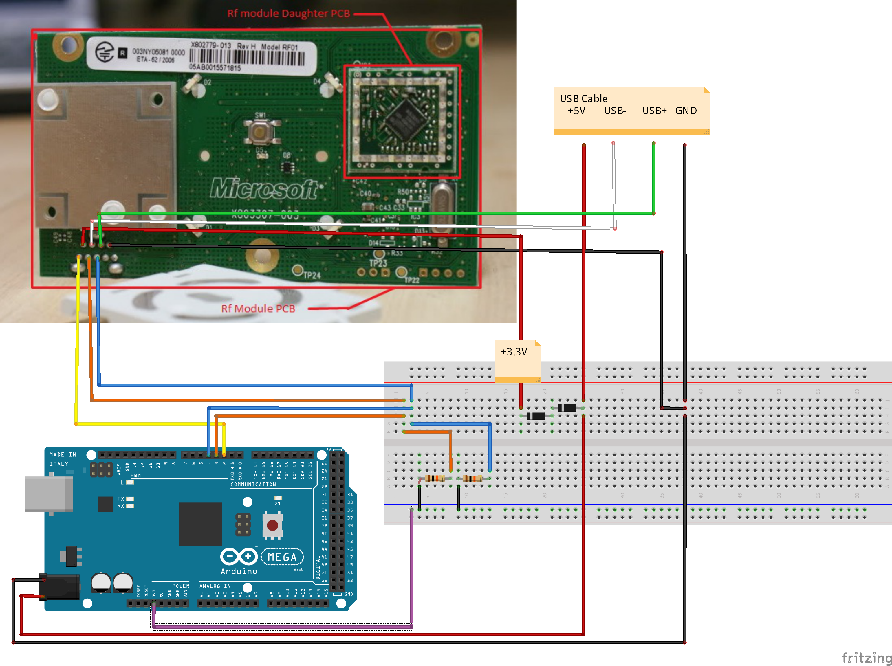
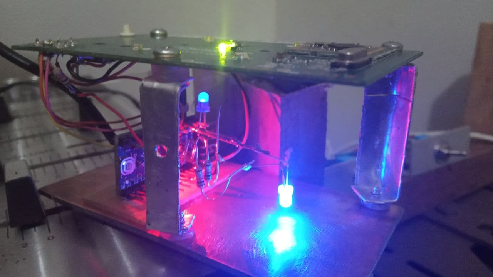

# ArduinoXbox360 Controller

# Soldering the pins
Image from <https://gr33nonline.wordpress.com/2015/09/19/make-an-xbox-receiver/>
Code to use with ArduinoUno <https://dilisilib.wordpress.com/hacking/xbox-360-rf-module-arduino/>

# Description
This code is edited from [Link](https://dilisilib.wordpress.com/hacking/xbox-360-rf-module-arduino/)

Add by me ArtCodeZen:
> Led pins 5 and 6 of arduino UNO
> Removed the Arduino sleep, because the Arduino has to change the brightness in execution time
> You can use and modify.

# About 

## All credits to your respective authors and developers

> Initial developer: yaywoop
> Additional Ideas : Alexander Martinez
> Arduino MEGA Xbox360 and Slim Module controller: gr33nonline

